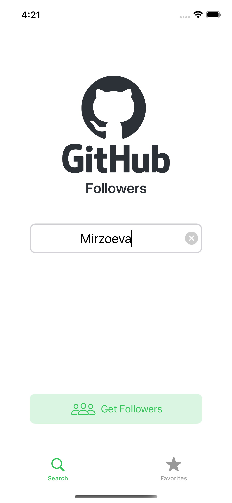
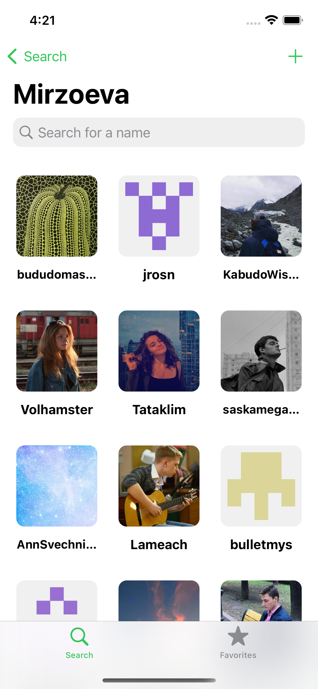
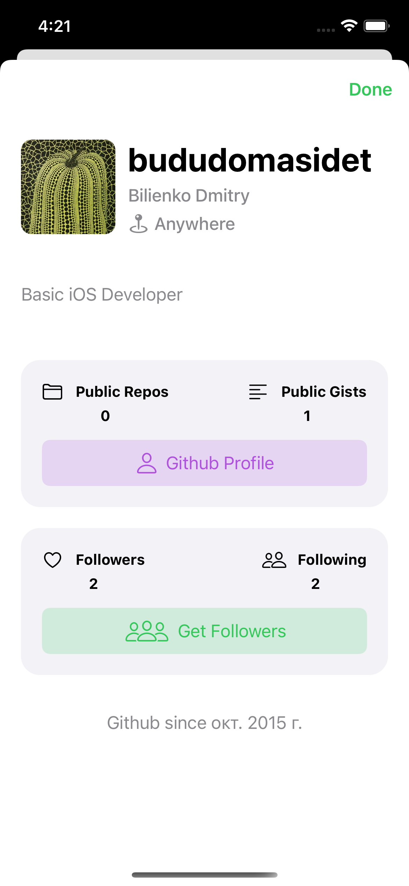
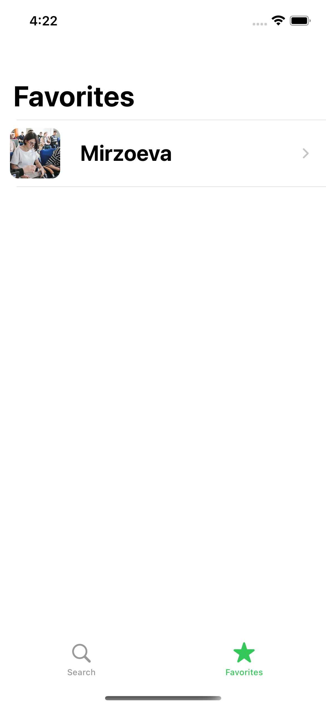
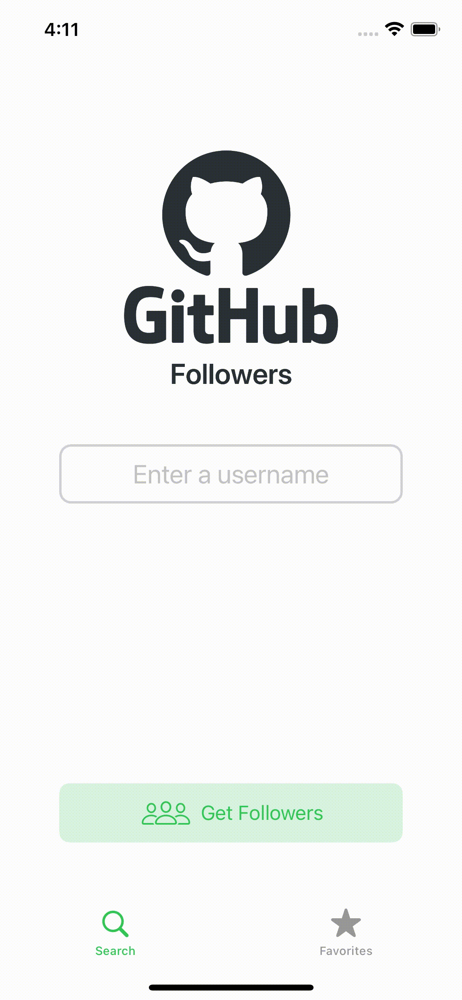
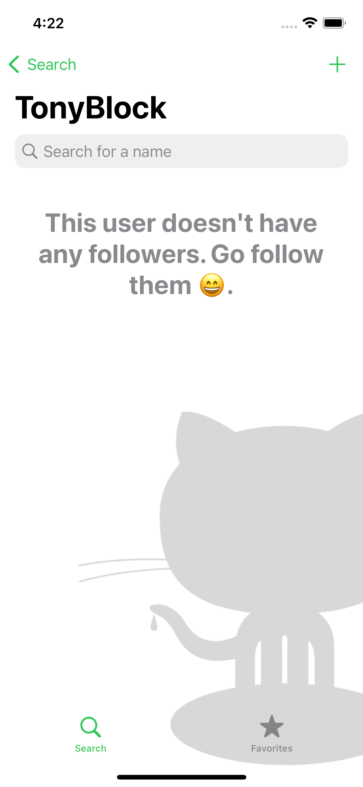
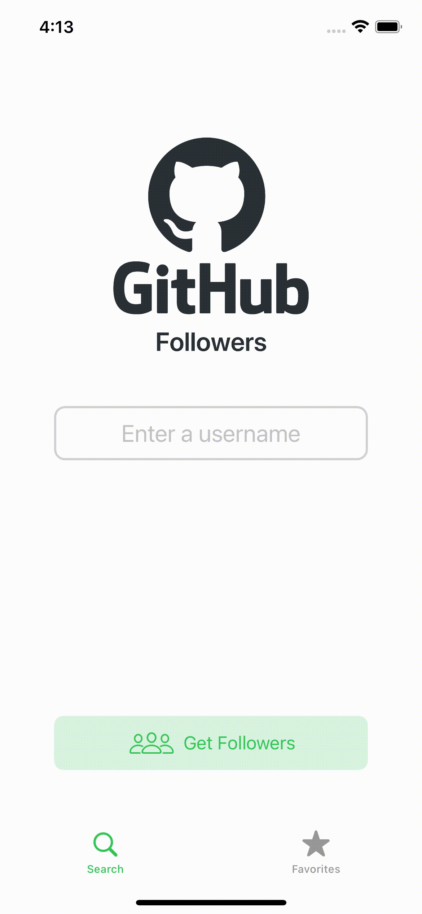
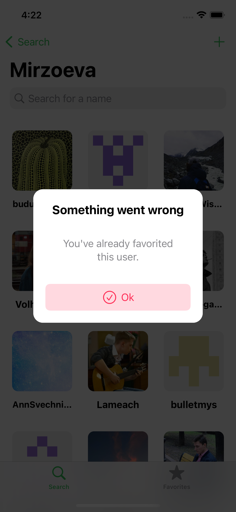

# Followers

## The search screen contains:
- The string that is used to search for the user and his subscribers.

## The subscribers screen contains:
- TableView with avatars and logins of all subscribers of this user.
- Subscribers are loaded with pagination. There are 100 users in each API request.
- Clicking on the TableView element opens a screen with information about the selected user.

## The screen with user information contains:
- Avatar, login, bio, location.
- There are also two ViewControllers with information about repositories and subscribers/subscriptions.
- It is possible to go to the user's page in safari and go to the subscribers screen of this user.

## The favorites screen contains:
- A list of users that you saved during the search.
- Deletion is possible with a swipe.

* When searching for subscribers, a user without subscribers has a custom screen warning about this.

* If the user does not exist, a custom alert announces this.

* Also, a custom alert declares an error when trying to add the same user to favorites more than twice.

